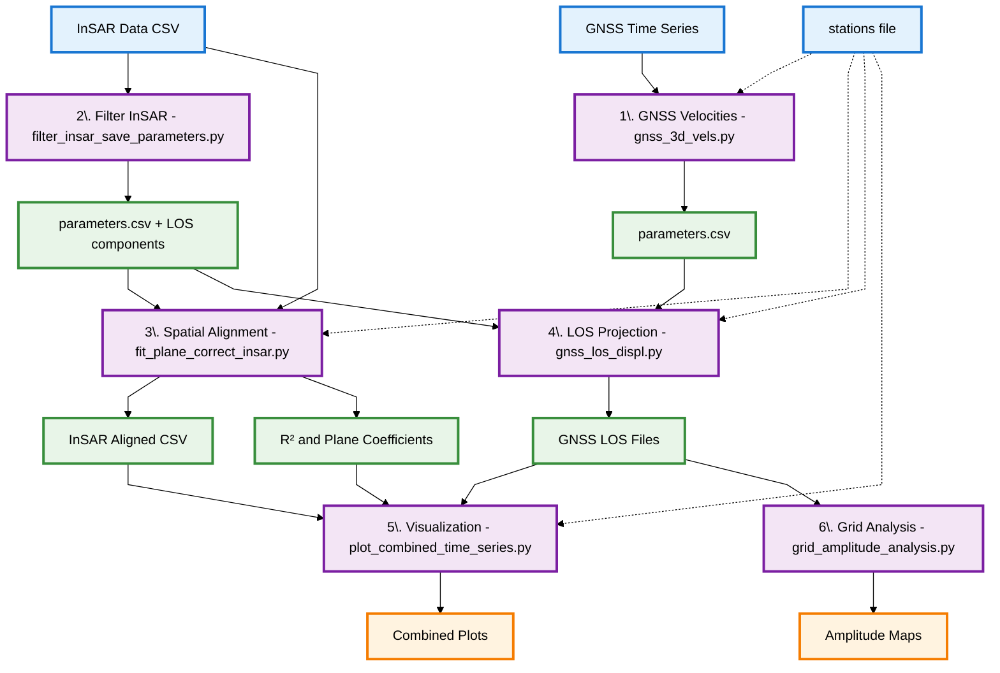
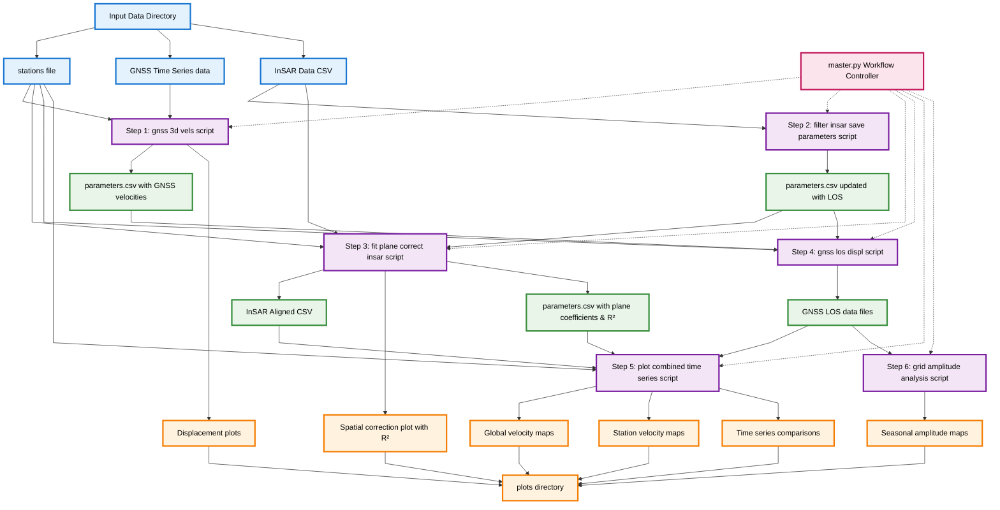

# GNSS-InSAR Integration Workflow Flowchart

## Overview
This flowchart shows the data flow and dependencies between scripts and data files in the GNSS-InSAR integration workflow.

## Simplified Workflow Overview



---

---

## Detailed Workflow Dependencies and Data Flow



## Script Execution Order

The workflow follows this strict sequential order:

1. **`gnss_3d_vels.py`** - Calculate 3D velocities from GNSS time series
2. **`filter_insar_save_parameters.py`** - Filter InSAR data and extract LOS parameters
3. **`fit_plane_correct_insar.py`** - Align InSAR data spatially with GNSS using plane correction with R² calculation
4. **`gnss_los_displ.py`** - Project GNSS displacements to Line-of-Sight direction
5. **`plot_combined_time_series.py`** - Create comprehensive time series visualizations
6. **`grid_amplitude_analysis.py`** - Optional grid-based spatial analysis

## Key Data Dependencies

### Critical Files Created and Used:
- **`parameters.csv`**: Created by `gnss_3d_vels.py` and updated by:
  - `filter_insar_save_parameters.py` (adds LOS components)
  - `fit_plane_correct_insar.py` (adds plane coefficients and R² value)
- **`_aligned.csv` file**: Created by `fit_plane_correct_insar.py`, used by `plot_combined_time_series.py`
- **`_LOS.txt` files**: Created by `gnss_los_displ.py`, used by `plot_combined_time_series.py`

### Environment Variables Configuration:
All scripts are controlled via environment variables set in `master.py`:
- `DATA_DIR`: Base directory for all data
- `INSAR_RADIUS`: Radius for InSAR point averaging
- `MIN_TEMPORAL_COHERENCE`: Quality threshold for InSAR filtering
- `GNSS_PROVIDER`: Data provider for GNSS format handling
- `INSAR_FILE`: Name of the InSAR CSV file
- `STATIONS_FILE`: Name of the stations list file

## Input Requirements

### Essential Input Files:
1. **`stations_list`**: Text file with station coordinates
2. **GNSS time series files**: `[Station]_NEU_TIME*.txt` format
3. **InSAR data file**: CSV with temporal coherence and displacement columns

### Directory Structure:
```
C:/insar_gnss_data/
├── stations_list
├── [Station]_NEU_TIME.txt files
├── EGMS_L2a_088_0297_IW3_VV_2019_2023_1_A.csv
├── parameters.csv (created and updated by workflow)
├── EGMS_L2a_088_0297_IW3_VV_2019_2023_1_A_aligned.csv (created by workflow)
└── plots/ (created automatically)
```

## Output Products

### Generated Data Files:
- Line-of-sight projected GNSS data (`_LOS.txt`)
- Spatially aligned InSAR data (`_aligned.csv`)
- Combined parameters file (`parameters.csv`) with:
  - GNSS velocities
  - InSAR LOS components
  - Plane correction coefficients
  - Plane fit R² value

### Visualization Outputs:
- Individual GNSS displacement plots
- Spatial correction visualization with R² values
- Combined velocity maps
- Station-specific velocity maps
- Time series comparison plots
- Grid-based amplitude analysis maps

## Performance Notes

- **Multiprocessing**: `plot_combined_time_series.py` uses parallel processing for speed
- **Memory optimization**: Large datasets are processed in batches
- **Runtime**: Complete workflow typically takes 8-10 minutes for moderate datasets
- **Critical dependencies**: Each step must complete successfully before the next begins
